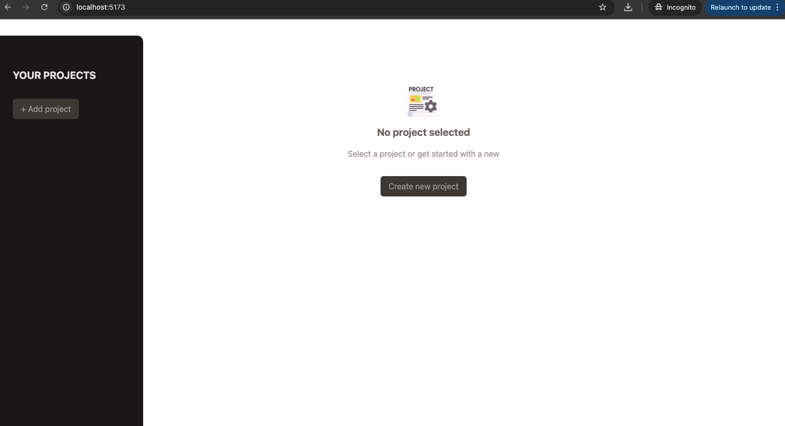
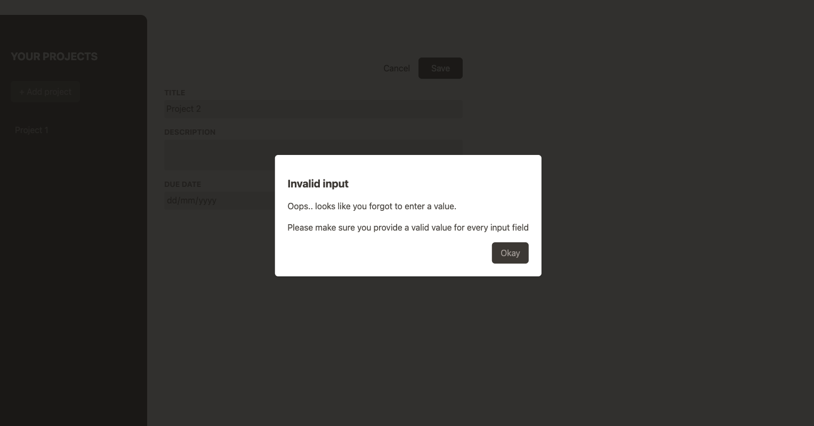
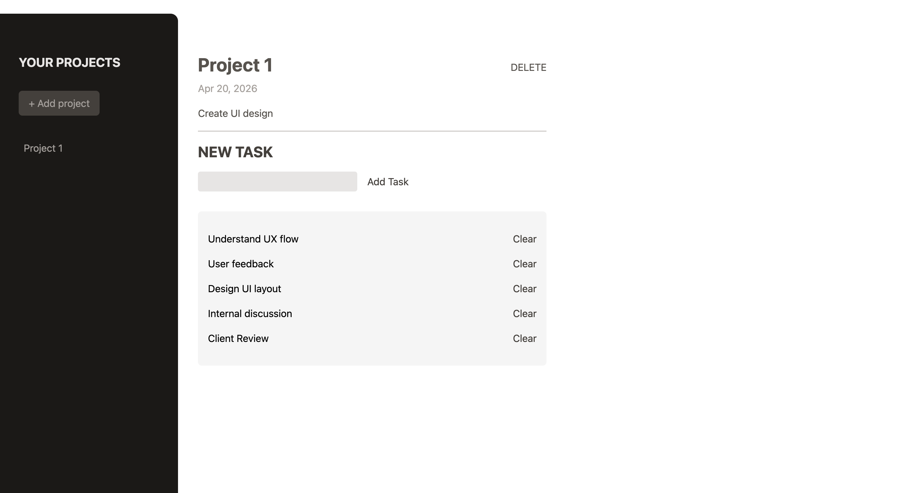

# 📌 Project Management App (React + Tailwind)

A simple and clean **Project & Task Management App** built using **React (Vite)** and **Tailwind CSS**.  
This app allows users to create projects, add tasks, and manage them efficiently.

---

## 🚀 Features

- 📁 Create new projects
- 📌 Select and view project details
- 📝 Add tasks to a project
- ❌ Delete tasks
- 🗑️ Delete projects
- ⚠️ Input validation with modal
- 🎨 Clean UI using Tailwind CSS

---

## 🛠️ Tech Stack

- ⚛️ React (useState, component-based architecture)
- ⚡ Vite (fast build tool)
- 🎨 Tailwind CSS
- 📦 JavaScript (ES6+)

---

## 📂 Folder Structure
src/
│
├── components/
│ ├── Input.jsx
│ ├── NewProject.jsx
│ ├── NoProjectSelected.jsx
│ ├── ProjectSidebar.jsx
│ ├── SelectedProject.jsx
│
├── App.jsx
├── main.jsx
└── App.css


---

## 📸 Screenshots

### 🔴 Home


### 🔴 Error Modal


### 🟣 Subtasks



---

## ⚙️ Installation & Setup

1. Clone the repository
```bash
git clone https://github.com/xdshivani/TaskManager.git
cd <folder>
npm install
npm run dev